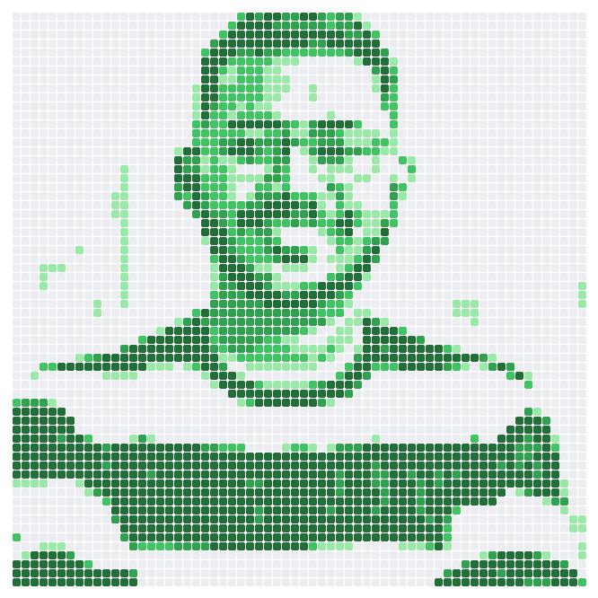
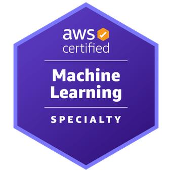

<!--
  UDAY GUPTA — GITHUB PROFILE README
  Lives in uday8898/uday8898 (repo name === username) so GitHub renders it on the profile.
  Portrait: ./assets/uday-contrib-full-light.png
-->

<div align="center">



```
█░█ █▀▄ ▄▀█ █▄█   █▀▀ █░█ █▀█ ▀█▀ ▄▀█
█▄█ █▄▀ █▀█ ░█░   █▄█ █▄█ █▀▀ ░█░ █▀█
```

### `Associate Product Engineer — AI @ Meridian Solutions`


[](https://www.linkedin.com/in/udayy/)
[](https://github.com/uday8898)
[](#)


</div>

---

## `$ whoami`

I live in the gap between **"can we sell this?"** and **"can we actually ship this?"** — and I do both, which means I have nobody to blame.

Full engagement lifecycle at Meridian: pitch, BRD, SOW, architecture, delivery, Microsoft partner audits. Translation: I wrote the proposal, built the thing the proposal promised, *and* defended it in the audit room with benchmark numbers. Mostly Microsoft stack — Azure AI, Fabric, Copilot Studio, Graph, Power Automate — for Indian and regional enterprise clients.

Somewhere along the way I became the guy who knows why the logo has a white box behind it and fixes it with PIL pixel masking. Nobody applied for that job. It was assigned by fate.

> **Currently obsessed with:** agentic architectures, voice AI, and enterprise documents that don't waste a single page.

---

## `$ ls ./certifications`

<div align="center">

<a href="#"></a>
&nbsp;
<a href="#"></a>
&nbsp;
<a href="#"></a>
&nbsp;
<a href="#"></a>

<sub>Three AWS certs. Employed at a Microsoft partner. I contain multitudes and a great many exam vouchers.</sub>

</div>

---

## `$ ls ./work` &nbsp;<sub>*(the stuff behind NDAs)*</sub>

| | Thing | Stack |
|:--:|:------|:------|
| 🎙️ | **"Aarti" voice assistant** — real-time conversational agent | Azure Speech · GPT-4o · FastAPI · React |
| ☎️ | **AI voice calling agent** — ~500 calls/hr, concurrency modelled with Little's Law before anyone asked | Twilio Media Streams · Azure |
| 🤖 | **"Organization 360"** — multi-agent finance + HR + market-data system | Azure AI Foundry |
| 📊 | **Credit propensity pipelines** — bureau data, carded cases, lead alerting, BENPOS workflows | Python · pandas |
| 🧾 | **Document generation engine** — BRDs, SOWs, HLDs, pricing calculators, RAI assessments | docx · openpyxl · ReportLab |

<sub>*Client names omitted. Ask me in a DM and I'll be vague with tremendous confidence.*</sub>

--------|:-------------|
| 🩺 | **[Diagnose](https://github.com/uday8898/skincancer)** | Skin cancer detection from a photo — [demo video](https://youtu.be/4SZCctRP6pY) |
| 🌿 | **[Plant Disease Detection](https://github.com/uday8898/plantdisease-detection)** | Plant Pathology 2020 FGVC7 → [live Streamlit app](https://plantdisease-detection-uday8898.streamlit.app/) |
| 🫁 | **[Medical Image Classifier](https://github.com/uday8898/Web-app-classification)** | Chest X-ray classification → [live Streamlit app](https://udaygupta-classificationwebapp.streamlit.app/) |
| 🧪 | **[Skin Diseases Diagnosis](https://github.com/uday8898/SkinDiseasesDiagnosis-IntelHackathon)** | CNN classifier built for the Intel Gen AI Hackathon |

---

## `$ pip list`

<div align="center">


</div>

---

<div align="center">

```
┌──────────────────────────────────────────────┐
│  A proposal you can't deliver is fiction.    │
│  A delivery nobody scoped is chaos.          │
│  I try very hard to live in the middle.      │
└──────────────────────────────────────────────┘
```

Open to conversations about **enterprise AI**, **Azure architecture**, **agentic systems**, and **why your Copilot agent isn't grounding properly**.

[](https://www.linkedin.com/in/udayy/)
[](https://github.com/uday8898)

```
> exit
Connection to uday closed. 🫡
```

</div>
